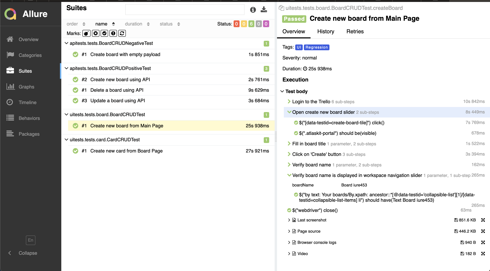

# Demo Test Automation Project - Trello


# <a name="Tech stack">Tech stack</a>

<p  align="center">
  
  
  
  
  
  
  
  
  
  
  
  
</p>

This project is written in <code>Java</code> \
<code>Selenide</code> is used for UI tests and <code>Rest-Assured</code> for API
>
> <code>Selenoid</code> is employed to launch browsers within <code>Docker</code> containers, providing an isolated testing environment.
>
> <code>Allure Report</code> is integrated into the project to generate comprehensive test run reports,
>
> <code>Gradle</code> is used for automated project build.
>
> <code>JUnit 5</code> is used as a unit testing library.
>
> <code>Jenkins</code> runs the tests.
>
> Upon completion of a test run, notifications are dispatched via a <code>Telegram</code> bot for seamless communication.

# <a name="Test running"> How to run tests </a>

## Run tests locally

### Precondition

<p>
For success tests running you need to add 2 files <code>apiAuth.properties</code> 
and <code>uiAuth.properties</code> and put them into <code>src/test/resources</code>
</p>

<details>
<summary><code>apiAuth.properties</code> example</summary>

```properties
uri=https://api.trello.com
key=83048509344509c03449583
token=ATTA36da17ab56cd0frje48b9b7c43dd5b6311a7e7baf977e7a9b35c54mfk78a246B69F7CD
```

</details>
<details>
<summary><code>uiAuth.properties</code> example</summary>

```properties
userLogin=someEmail@gmail.com
userPassword=somePassword
```

</details>

<p>
There are 2 options to run tests locally
</p>

### 1. Run tests and reporting using terminal

To run tests put this command in terminal

```
gradle clean {task}
```

Task options:
> <code>test</code>, <code>regressionTests</code>, <code>apiTests</code>, <code>uiTests</code>

#### To open Allure report

```
allure serve build/allure-results
```

### 2. Run tests and reporting using gradle tasks in IntelliJ IDEA


#### To open Allure report run task allure-serve

## Run tests remotely using Jenkins

### 1. Setup environment with Docker

- Put files <code>docker-compose.yaml</code> and <code>browsers.json</code> in target directory.
- Download necessary docker images

```
docker pull {image}
```

- Open terminal in this directory and run the command

```
docker-compose up -d
```

<p>Docker container should be created and running</p>
<p></p>

### 2. Setup Jenkins job

Create **Freestyle project** and create following steps:

<details>
<summary>Source Code Management</summary>

</details>

<details>
<summary>Create file for telegram notification</summary>

</details>

<details>
<summary>Create file apiAuth.properties</summary>

</details>

<details>
<summary>Create file uiAuth.properties</summary>

</details>

<details>
<summary>Gradle script</summary>


```
clean test
-Dbrowser=${BROWSER}
-DbrowserVersion=${BROWSER_VERSION}
-DbrowserSize=${BROWSER_SIZE}
-DbrowserMobileView="${BROWSER_MOBILE}"
-DremoteDriverUrl=https://user1:1234@${REMOTE_DRIVER_URL}/wd/hub/
-DvideoStorage=https://${REMOTE_DRIVER_URL}/video/
-Dthreads=${THREADS}
```

</details>

<details>
<summary>Allure Report</summary>

</details>

<details>
<summary>Telegram notification post-build task</summary>

</details>

### 3. Run Jenkins job and get results


## Reporting with Allure

### Main Page


### Suite view



### Behavior view


### Filtering by tag


## Notification in Telegram


